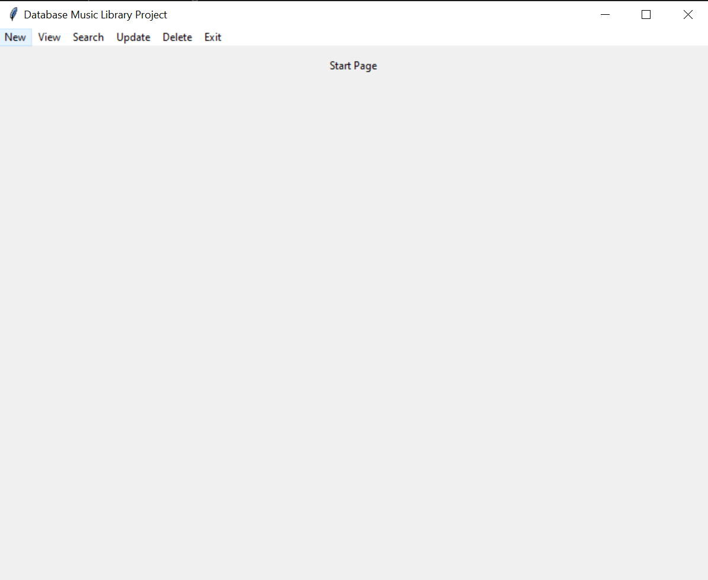
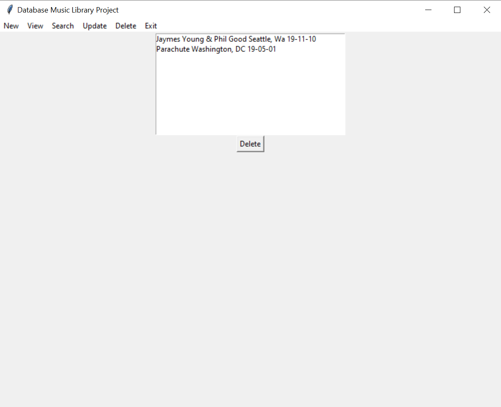
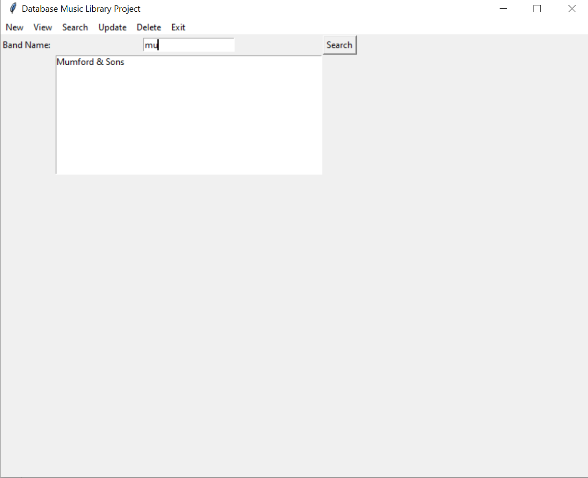
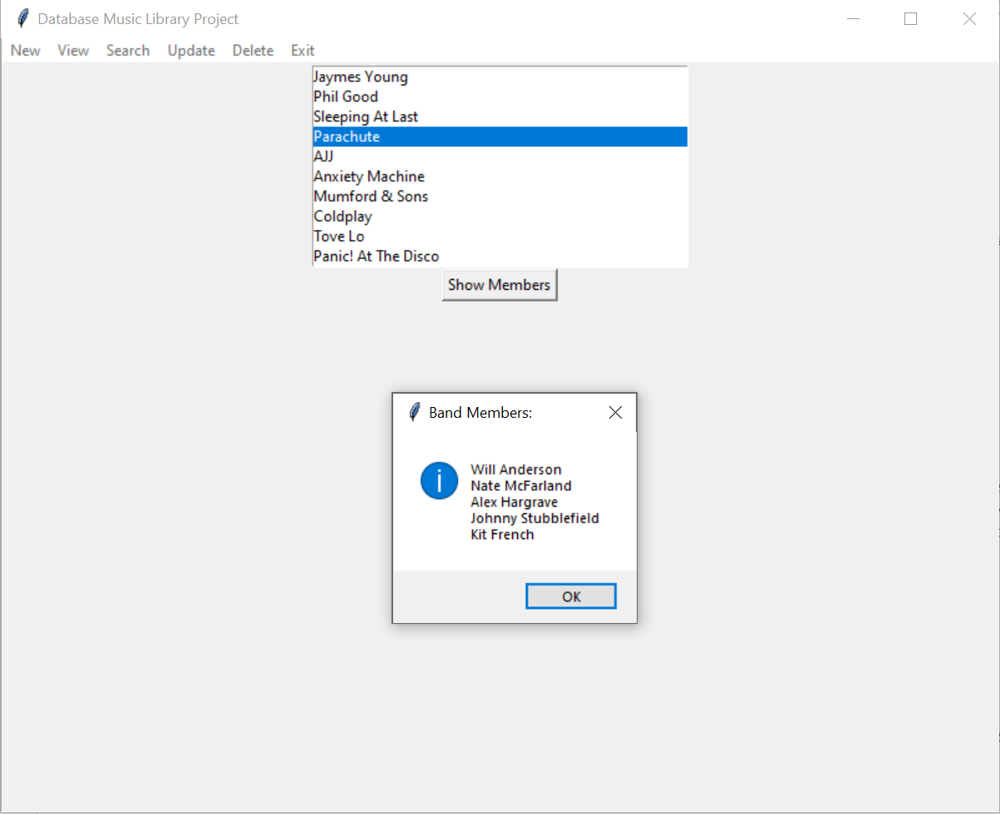

## Portfolio

---
### Class Projects
<h3>Database Application</h3>

<ul>
  <li>Designed and created database to store information about music and bands</li>
  <li>Built application in Python that interacts with database allowing creation of concerts, viewing songs and albumns, searching for playlist, and view members of a band</li>
  <li>Built using the Tkinter Library for Python</li>
  <li>My role on the team was the Project Manager and I also built the framework of the application. I also completed the pages and queries for creation, viewing, updating, and deleting concerts.</li>
</ul>

### Work Experience 

<h3>Cloud Computing Pathfinder Intern at NASA</h3>

<ul>
  <li>Worked with the Information Technology Solutions Team to build an application using Amazon Web Services</li>
  <li>Automated a connection to an API to download thousands of data files and store in a cloud-based bucket</li>
  <li>Used downloaded files to train a machine learning model to read and tag scientific article abstracts with relevant terms</li>
  <li>Developed the model through Natural Language Processing</li>
  <li>Used Reinforcement Learning to train an automous car to race around a track</li>
  <li>Presented the project at a poster fair</li>
</ul>

---
[Top Shelf Media Web Developer](http://twelfthroundauto.com/)
<ul>
  <li>Improved site speeds by compressing images, reconfiguring file loading placement, and implementing lazy loading</li>
  <li>Worked in WordPress Content Management System</li>
</ul>

---

Page template forked from <a href="https://github.com/evanca/quick-portfolio">evanca</a>

<!-- Remove above link if you don't want to attribute -->
