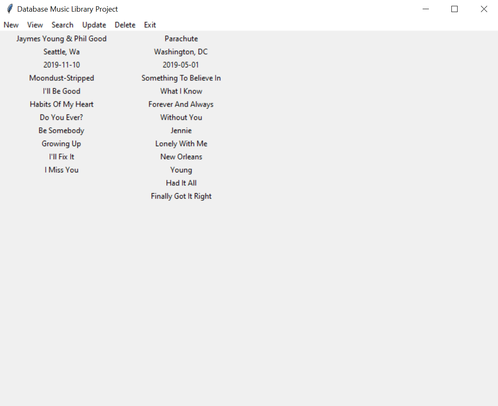

## Portfolio

---
### Work Experience 
<h4>Amazon Web Services Solutions Architect Intern</h4>

In the summer of 2020, I worked remotely for Amazon Web Services as a Solutions Architect Intern. My role included a variety of responsibilities to learn about the role. I shadowed customer calls every week to observe how to communicate with customers. I was given a project to architect and implement the back end of a flash card learning app hosted on AWS. In this project, I built an API, coded the learning algorithm, as well as the managment of the database. I also entered and won an Alexa hackation where my team built an Alexa skill to help onboard interns. Finally, I recieved my AWS Cloud Practioner certification.

---
<h4>Cloud Computing Pathfinder Intern at NASA</h4>

I worked at NASA Goddard Campus in the Cloud Computing IT Soltuions Team during the summer of 2019. I was provided the architecture of an application to be build on Amazon Web Services and spent the summer implementing it. I automated a connection to an API in order to download thousands of data files and store it in a S3 bucket. I used those files to train a model to read and tag scientific articles with relevant terms in order to search these articles more accurately. I learned and used concepts from Natural Language Processing. I also competed in an AWS DeepRacer event where I trained a self-driving car through Reinforcement learning.

---
[Top Shelf Media Web Developer](http://twelfthroundauto.com/)

I improved site loading speed by compressing images, reconfiguring file loading placement, and implementing lazy loading of images on the site. This was all done through Wordpress Content Managment System.

---
### Class Projects
<h4>COVID-19 Visualization App for Data Science</h4>

This was my final project for the Intro to Data Science class I took. I built an app in R that visualizes COVID-19 world data according to user selected values.

---
<h4>Music Database Application for Database Managment</h4>

This was my final project for my Database Managment class. We learned how to design, build, and manage a relational database. We applied what we learned in this final project.</i>
<i>Our final database stores user music data. Our application was built in the Python coding language. The functionality allows the creation of concerts, viewing songs and albums, searching for a playlist, deleting data, modifying data, and viewing members of a band.</i>
<i>I had the role of Project Manager and I also built the framework of the application. I completed the functionality for creation, viewing, updating, and deleting concerts in the database.

---

Page template forked from <a href="https://github.com/evanca/quick-portfolio">evanca</a>

<!-- Remove above link if you don't want to attribute -->
