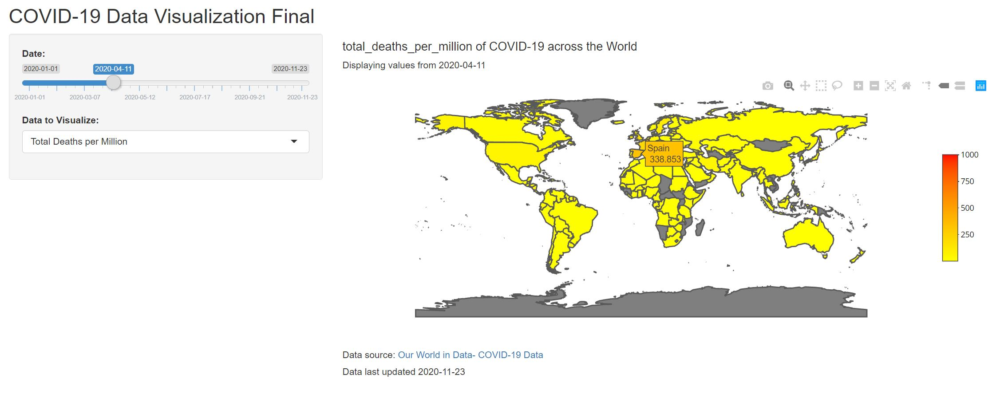

## Emma Zimmerman

I believe technology and engineering is best with the end user in mind. Making solutions with positive impact as the end goal.

I have worked on a variety of projects that require skills from System Architecture, database design, web engineer, networking, and backend coding.

---
### Projects
<h4>COVID-19 Visualization App for Data Science</h4>

This was my final project for the Intro to Data Science class I took. I built an app in R that visualizes COVID-19 world data according to user selected values.

Users would be able to choose the date range and metric they were interested in. The world map would update with a heatmap of the data according to country.

Tooltips will show the actual value when hovering over a country.

---
<h4>Music Database Application for Database Managment</h4>

This was my final project for my Database Managment class. We learned how to design, build, and manage a relational database. We applied what we learned in this final project.</i>
<i>Our final database stores user music data. Our application was built in the Python coding language. The functionality allows the creation of concerts, viewing songs and albums, searching for a playlist, deleting data, modifying data, and viewing members of a band.</i>
<i>I had the role of Project Manager and I also built the framework of the application. I completed the functionality for creation, viewing, updating, and deleting concerts in the database.

---

Page template forked from <a href="https://github.com/evanca/quick-portfolio">evanca</a>

<!-- Remove above link if you don't want to attribute -->
